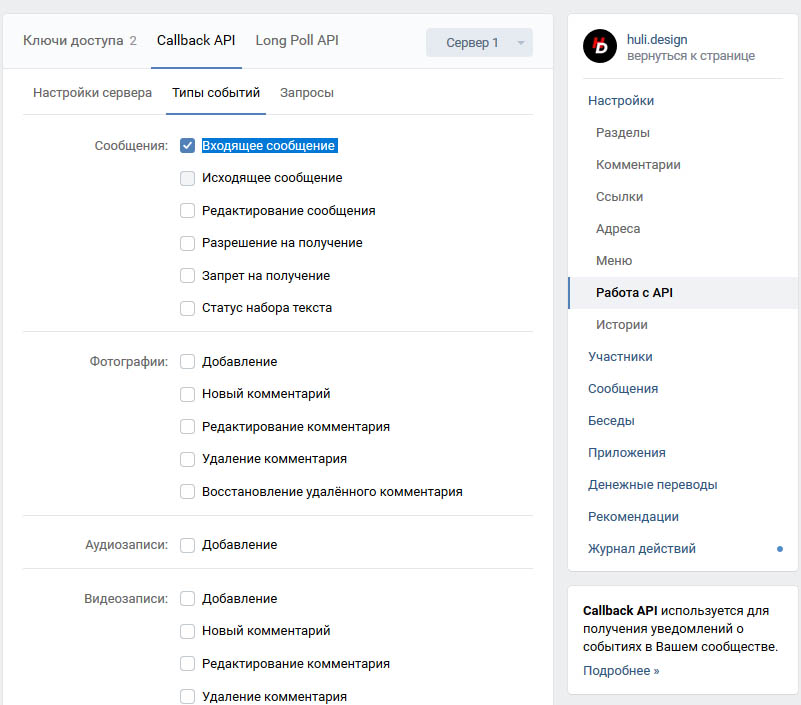

## Huli.design - бот
 
 
#### Установка
1. Скачать бота.

2. Установить virtualenv с помощью команды
```
pip install virtualenv
```

3. Создать виртуальное окружение запустив команду в папке с ботом
```
python -m venv env
```

4. В той же папке прописываем команду
```
env\Scripts\activate
```

5. Установите все зависимости
```
pip install -r requirements.txt
```

6. Настройте **VkConfig** в файле `config.py`

7. Создайте и примените миграции для базы данных
```
python manager.py db init
python manager.py db migrate
python manager.py db upgrade
```

8. Запустите файл `main.py`
```
python main.py
```


#### Подключение через ngrok

1. Параллельно с ботом запустите ngrok 
```
ngrok http 5000
```
2. Скопируйте полученный URL и вставьте в настройках сообщества


3. Поставьте галочку во вкладке **Типы событий** на пункте `Входящее сообщение`

